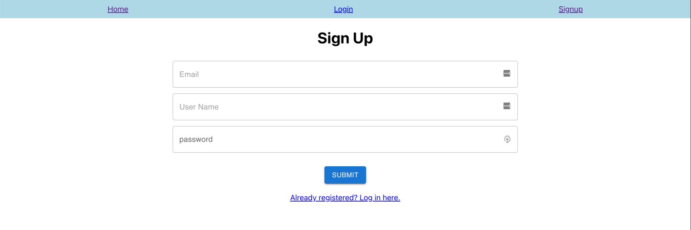
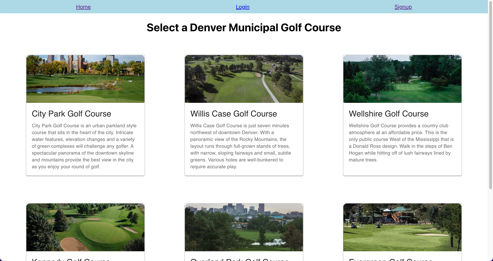
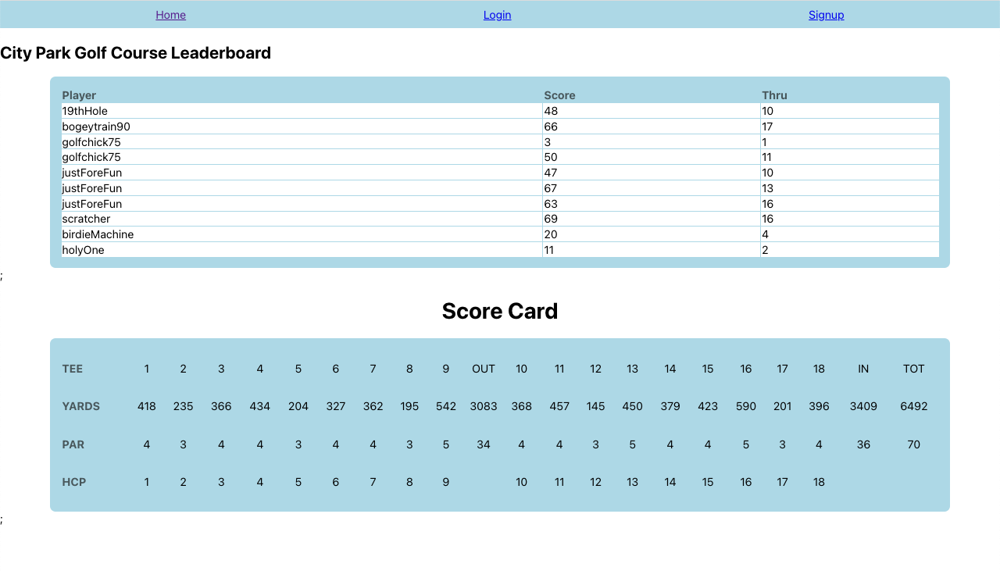

# Bracket Bois - Golf App

## Description

The bracket bois golf app provides a fun interactive experience for the average golfer to experience tournament leaderboards at their local municipal colf course. 

It leverages the latest technologies, including: a front-end user interface built completely from React, Apollo Server to handle all of the front-end routes, GraphQL mutations and queries to interact with the Mongo Database. Authentication for the app is handled using JSON web tokens and the app leverages CSS properties like flexbox to make it mobile responsive for smaller screens. 

The application is hosted on Heroku, and compressed using webpack to optimize the production build and make it lightweight and fast even for users on small devices.

## Badges

 

## Table of Contents

- [Installation](#installation)
- [Usage](#usage)
- [License](#license)
- [Contributing](#contributing)
- [Tests](#tests)
- [Questions](#questions)

## Installation

The Bracket Bois - Golf App is deployed to heroku, so end user just looking to use the application don't need to install anything. Just click [here](https://stormy-tundra-99925.herokuapp.com/) to access the deployed production application.

Being an open source repository, however, developers may view the source code and run the application locally to enhance features. To install locally to your machine, fork the repository from Github and clone it to your local environment. 

Once installed locally, use the `npm i` command line prompt to install all of the package dependencies for the application. Check the connection file in the /server/config directory to ensure that the details will allow for connection to your MongoDB environment (you will need to create a MongoDB account if you do not already have one). 

The last step before starting the application is to run `npm run seed`, which will seed the MongoDB with the sample users, courses and rounds required for the application to run.

## Usage

This application is intended for use by the amatuer golfers playing rounds at any one of the City of Denver's municipal golf courses. The user must signup or login to access many of the features of the app. 

Once authenticated, they may select a course from the list of Denver's six municipal golf courses. 

Doing so will take them to the "SingleCourse" page where they can see a live leaderboard of all the other players playing that course for the day. The scorecard component at the bottom of the page is linked to the leaderboard at the top, so any scores entered below will immediately reflect in the leaderboard.

The following sections outline the steps for running the application locally and packaging the completed build for a production deployment.

### `npm start`

Runs the app in the development mode.\
Open [http://localhost:3000](http://localhost:3000) to view it in your browser.

The page will reload when you make changes.\
You may also see any lint errors in the console.

### `npm run build`

Builds the app for production to the `build` folder.\
It correctly bundles React in production mode and optimizes the build for the best performance.

The build is minified and the filenames include the hashes.\
Your app is ready to be deployed!

## License

This project is licensed under the terms of the [MIT license](https://choosealicense.com/licenses/mit/).

## Contributing

We are always looking to make our application better. Please contact the email address below if you have recommendations for how this app could be improved. We recognize the need for better state management throughout the application to optimize the user's experience and keep all of the components operating in concert. Any contributions to that area would be especially appreciated.

## Tests

This application does not use any tests.

## Questions

This application was created by [Chris Leavengood, Chris Tierney, and Clayton Weber (the Bracket Bois)](https://github.com/Cleave13). Any questions related to this application can be sent to chrisleavengood@gmail.com